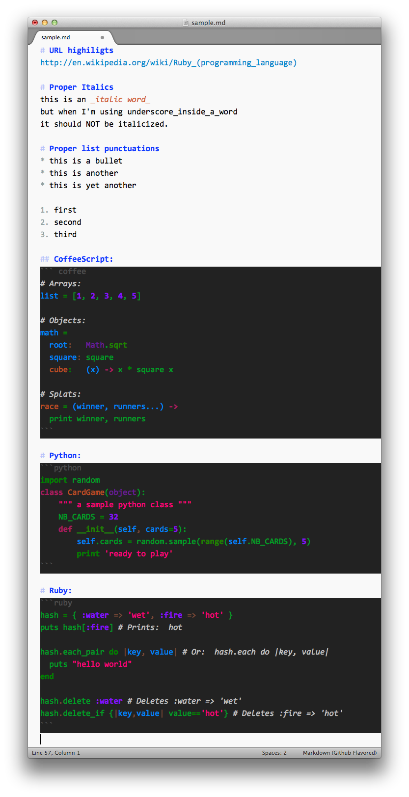

# [Knockdown](https://github.com/aziz/knockdown)
Github flavored Markdown for SublimeText and a custom color-scheme for writing markdown.

### Features:
* Support for fenced code blocks
* Syntax highlighting support for most popular languages (see below for the list of supported languages)
* Syntax highlighting for URLs in text which is auto-linked by GFM
* Proper syntax highlighting for bullets and numbers in ordered/unordered lists
* Proper syntax highlighting for bold and italics by ignoring multiple underscores in words

### Installation
To install this plugin, you have two options:

1. If you have Package Control installed, simply search for `Knockdown` to install.
2. Clone source code to Sublime Text packages folder.

> **Note:** after installing this package, open a markdow file and switch the language
> to `Markdown (Github Flavored)` from the list of supported languages in your status 
> bar at the bottom right corner of your editor. 

#### Syntax Highlighting support
* Coffeescript
* Javascript and Json
* HTML and XML
* CSS
* LESS
* Sass and SCSS
* Python
* Ruby
* Shell
* C++ and C
* Objective-C
* Java
* Perl
* PHP
* Scala
* YAML
* Diff
* SQL

## License
Copyright 2012-2013 [Allen Bargi](https://twitter.com/aziz). Licensed under the MIT License